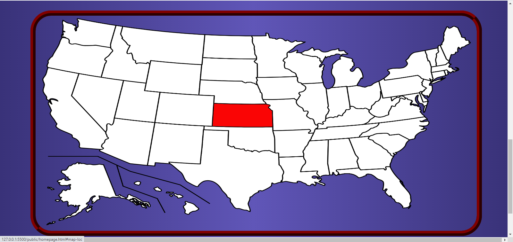

# Waccurate
 A web application using HTML, CSS, Javascript, Bootstrap, and NodeJs that shows how accurate Accuweather's forecasts are based on different variables.

<h2>Overview</h2>
The purpose of Waccurate is for users to be able to observe how accurate Accuweather's predictions are in their general area. Waccurate allows
seeing the percentage accuracy of an Accuweather forecast of up to and including 12 hours. This site is not finished, as some more functionality
that still needs to be included is:
<ul>
 <li>Refactoring the interactive map of the United States so that it is responsive to the viewport size. As of now it breaks if that happens</li>
 <li>Icon images hovering above each state on the interactive map giving a graphical and numerical representation of the current temperature in the capital of each state</li>
 <li>Adding an animation so that when a user clicks the calculate button after giving their input, a lightning strike comes from the animated clouds</li>
 <li>Displaying more information about a state's weather if clicked on from the interactive map</li>
 <li>Making the cities of each state clickable once a user clicks on a state in the interactive map</li>
</ul>

Those are just a few of the more major things I would like to get to at some point.

The weather data I used for this map comes from the Accuweather API and was collected over a one month period. That means the results that are displayed once 
a user gives appropriate inputs to the program <b>are not completely accurate</b>. To collect enough data to make the percentage accuracy predictions
given by the program plausible would take a lot of money (The Accuweather API costs money) and time (since I had to manually run my program everyday at a specific 
time in order to keep my data organized). The data is stored in text files in the form of JSON objects. The raw data retrieved from the Accuweather API had its own JSON 
format, which I had modified so that my program could read the data more efficiently and so that redundant data was omitted. 

<h1> How It Works </h1>
<h2> Input Area </h2>

The input area allows for the user to specify what kind of weather data they would like to see. The <em> Time Until Prediction </em> box allows the user to see the accuracy of an average weather prediction after a specified number of hours. If the user wants a true accuracy average they can click the <em> all </em> button for all time frames. The second input box is a dropdown menu containing three values: temperature, weather, and precipitation. This is what specific statistic the program is going to find the accuracy for. On the third button the user can optionally choose which state they would like to see accuracy predictions for. If a user chooses a state from the dropdown menu of this button, the output will only display accuracy percentages for the average of all cities in that state. Note, only the accuracy of the capital cities of each state can be shown since it would take a very long time to get the data of multiple cities. Both the <em>Precipitation</em> and <em>Temperature</em> boxes reference the <em>Precision</em> box in that the user must choose which units to use for the precision of what an accurate temperature or precipitation amount would be. The <em>Precision</em> box will only be available if the weather statistic under consideration is measured in numerical units (like temperature and precipitation).

<h2>Interactive map</h2>

The interactive map of the United States allows for users to easily select which states they want to obtain weather statistic information from. Thanks to David Bradshaw and his Image Map Resizer code, I was able to make the map of the United States responsive. Each state will light up red whenever the cursor is hovering over it. If clicked, a state will be enlarged to get a better view of the full state. It was intended that there would be multiple cities that would display on the image of the state for a user to choose. This had been my original plan before I wrote the code for the project, but I had realized after coding that this would be a lot of very tedious and time-consuming work. Once a user clicks on a state, it will fill up the <em> state/region </em> box and allow the user to calculate the accuracy for that state, which right now is the same as calculating the accuracy for the capital city of that state.  

